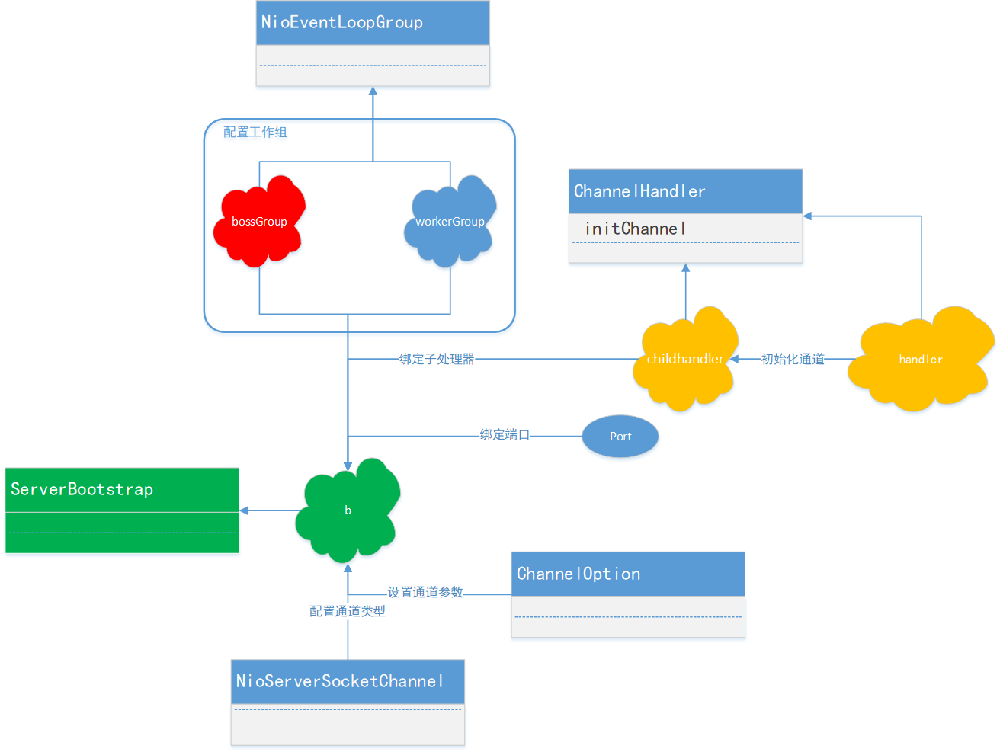
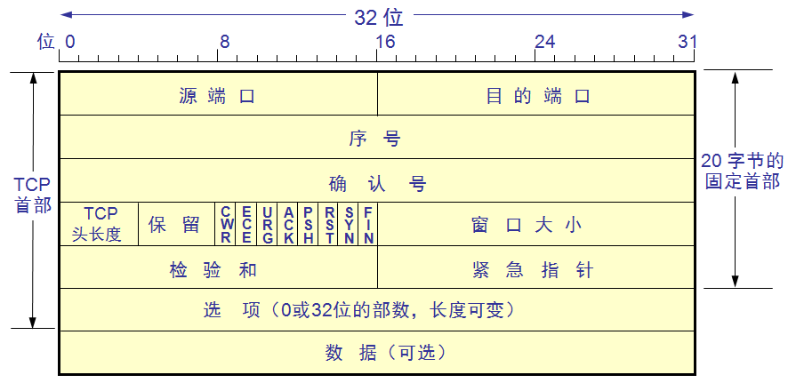

## 伪异步

### 从输入流上看

当对方发送的请求或者应答消息比较缓慢，或者网络比较慢，读取输入流一方的通信线程将被将被长时间阻塞，如果对方要60s才能发送完成，读取的一方I/O线程也将会被阻塞60s,在此期间，其他接入消息只能在消息队列中排队

### 从输出流上看

tcp拥堵控制、当接收方不能及时的从TCP缓冲区读取数据，这将导致发送方的TCP window
size不断的减小，直到为0，双方处于Keep-Alive状态，消息发送方将不能再向TCP缓冲区写入消息，如果采用的是同步阻塞I/O,
write操作将被无限期的阻塞下去，直到TCP的window size 大于0或者发生IO异常

## NIO

### 基础

```plantuml
Nio_Server ->Nio_Server :  打开 ServerChannel
Nio_Server ->Nio_Server : 绑定监听地址
Nio_Server -> Reactor_Thread: 创建Selector,启动线程
Nio_Server -> Reactor_Thread: 将ServerChannel注册到selector,启动线程
Reactor_Thread -> IO_Handler: Selector 轮询就绪的Key
Reactor_Thread -> IO_Handler: handlerAccept()处理新的客户端接入
IO_Handler -> IO_Handler: 设置新建客户端的Socket参数
IO_Handler -> Reactor_Thread: 向Selector 注册监听读操作 SelectionKey.OP_READ
Reactor_Thread -> IO_Handler: handlerRead()异步读取请求的消息到<b>ByteBuffer
IO_Handler->IO_Handler: decode 异步读取请求的消息
IO_Handler->Reactor_Thread: 异步写ByteBuffer到SocketChannel
```

### Netty入门



## TCP粘包、拆包
### TCP 基础概念

###

